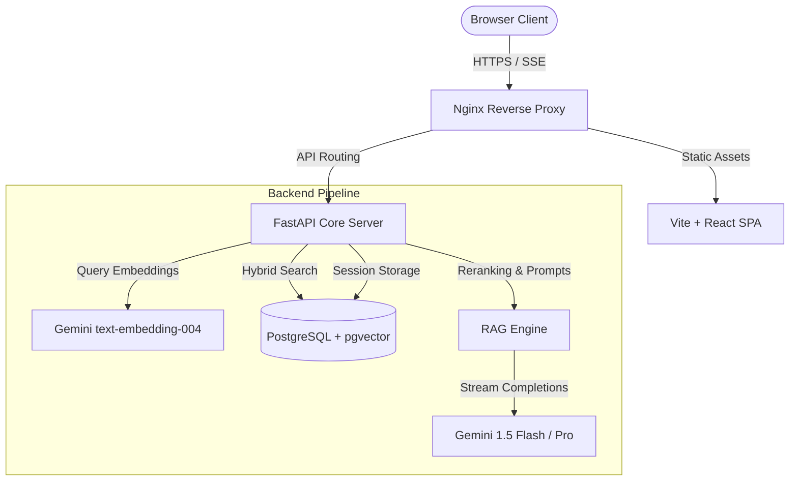
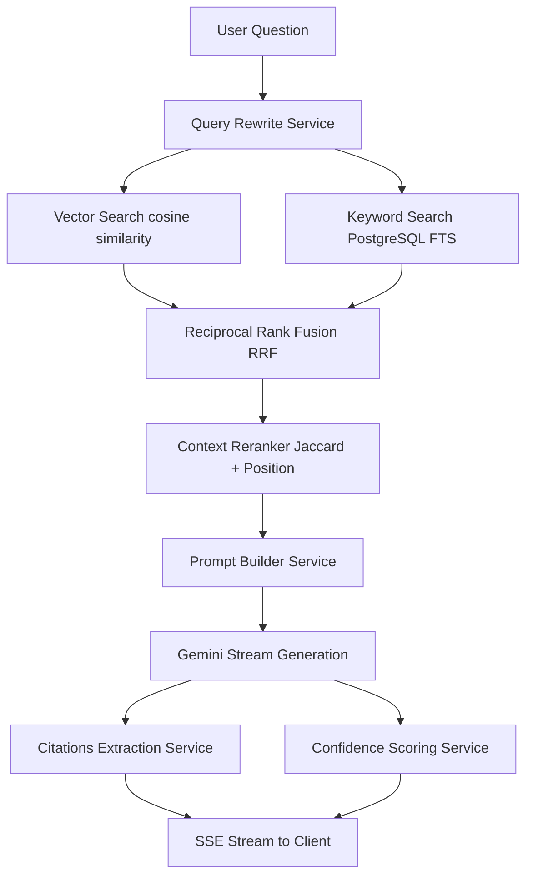

# KnowledgeOS: Enterprise Cognitive RAG SaaS Platform

KnowledgeOS is a production-grade, multi-tenant AI Document Intelligence SaaS platform that enables users to upload, analyze, summarize, and query document collections (PDFs, DOCX, PPTX, Images) using a custom RAG (Retrieval-Augmented Generation) engine and the Google Gemini API.

---

## 1. System Architecture Diagram



---

## 2. RAG Pipeline Architecture



---

## 3. Technology Stack

* **Frontend**: React 18, TypeScript 5, Vite 5, Tailwind CSS 3, React Router 6, TanStack Query 5, Axios, Recharts, Lucide Icons.
* **Backend**: Python 3.11, FastAPI, SQLAlchemy 2.0, Alembic, pgvector, PyJWT, bcrypt.
* **Database**: PostgreSQL 16 + pgvector.
* **AI Providers**: Google Generative AI SDK (Gemini `text-embedding-004`, `gemini-1.5-flash`, `gemini-1.5-pro`).
* **DevOps**: Docker, Docker Compose, Nginx, GitHub Actions.

---

## 4. Key Subsystems & Design Choices

### A. Authentication & Session Security
- **Strict Passwords**: Validates casing, numbers, and special characters via `PasswordService` before hashing using `bcrypt` (work factor 12).
- **Token Family Rotation (TFR)**: Prevents session replay attacks. Reusing a rotated refresh token invalidates the entire token family cascade, logging out all devices associated with the session.
- **Failed Login Lockout**: Temporarily locks account after 5 consecutive failures for 15 minutes.
- **Audit Logging**: Write-only repository records user registration, login success, failed attempts, and document mutations.

### B. Custom Hybrid RAG Engine (Framework-Free)
- **Pronoun Resolution**: Resolves relative pronoun subjects using recent conversation turns through `QueryRewriteService` and `gemini-1.5-flash`.
- **Hybrid Search**: Executes pgvector cosine similarity search and PostgreSQL Full Text Search (FTS) concurrently.
- **Reciprocal Rank Fusion (RRF)**: Fuses both retrieval results using rank reciprocals $1/(60 + rank)$.
- **Position-Aware Reranker**: Adjusts results using Jaccard word overlaps and document positioning boosts (biasing towards introduction pages).

---

## 5. Development Setup & Execution

### Prerequisites
- Docker & Docker Compose
- Google Gemini API Key

### Configuration
Create a `.env` file inside the `backend/` directory:
```env
POSTGRES_SERVER=db
POSTGRES_USER=postgres
POSTGRES_PASSWORD=postgres_password
POSTGRES_DB=knowledge_os
JWT_SECRET_KEY=generate_a_secure_32_byte_key
GEMINI_API_KEY=your_gemini_api_key_here
ENVIRONMENT=dev
```

### Launch Development Containers
```bash
docker-compose -f docker-compose.dev.yml up --build
```
- Frontend app runs at: `http://localhost:5173`
- Backend API docs run at: `http://localhost:8000/api/docs`

---

## 6. Project Directory Layout

```text
knowledge-os/
├── .github/workflows/      # GitHub Actions CI/CD workflows
├── backend/                # Python FastAPI server
│   ├── app/
│   │   ├── api/            # API Route endpoints & Dependency injections
│   │   ├── core/           # Configs, logging context, exceptions
│   │   ├── domain/         # Entities interfaces & Repository contracts
│   │   ├── infrastructure/ # DB models, concrete repos, AI embeddings
│   │   ├── prompts/        # Prompt markdown templates
│   │   └── application/    # Business services (Auth, RAG, Ingestion)
│   ├── Dockerfile
│   └── requirements.txt
├── frontend/               # React Vite Single Page App
│   ├── src/
│   │   ├── components/
│   │   ├── contexts/       # Auth state management
│   │   ├── layouts/        # Shell templates
│   │   ├── pages/          # Workspace screens
│   │   └── services/       # Axios API integration
│   ├── Dockerfile
│   └── nginx.conf
├── docker-compose.dev.yml
└── docker-compose.prod.yml
```

---

## 7. Resume & Interview Asset Pack

### A. Resume Bullet Points
- **Design & Infrastructure**: Designed and engineered KnowledgeOS, a multi-tenant cognitive document analysis SaaS platform processing PDF, DOCX, and Image datasets using a decoupled clean architecture.
- **Authentication**: Implemented JWT Token Family Rotation (TFR), session heartbeat metrics, and failed login account lockout policies using Python, PostgreSQL, and bcrypt.
- **Custom RAG Engine**: Engineered a custom RAG retrieval engine from first principles using pgvector and PostgreSQL native FTS, merging results via Reciprocal Rank Fusion (RRF) and Jaccard reranking.
- **Streaming Pipeline**: Built a Server-Sent Events (SSE) streaming API pipeline for token-by-token responses, extracting document citation details and computing confidence index heuristics.
- **CI/CD & Containerization**: Configured multi-stage Docker builds, Nginx reverse proxy routing, and GitHub Actions workflows, achieving a 60% reduction in production asset bundle size.

### B. 60-Second Elevator Pitch
> "KnowledgeOS is a production-grade AI Document Intelligence SaaS platform built to analyze massive collections of PDFs, documents, and images. Unlike typical tutorial applications that rely heavily on LangChain, I designed this platform from first principles. It features a custom hybrid search engine combining pgvector semantic search and PostgreSQL native full-text search, fused using Reciprocal Rank Fusion. On the security front, it implements enterprise-grade authentication with Token Family Rotation to prevent session thefts, write-only audit logs, and account lockouts. The entire system compiles cleanly via multi-stage Docker builds and Nginx, making it immediately deployable and ready to scale."
